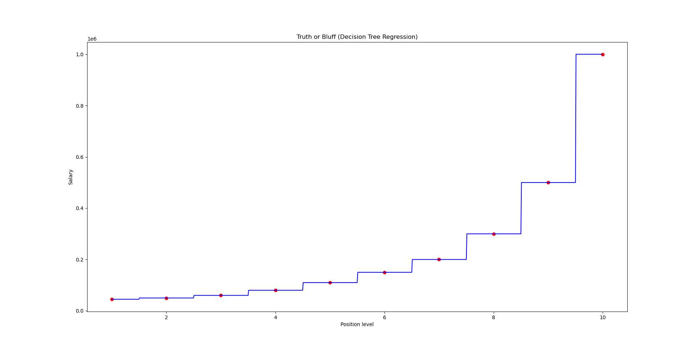

# Decision_tree_regression

## English version:

### Description

This project demonstrates the implementation of Decision Tree Regression to predict salaries based on position levels. The dataset contains information about various positions in a company along with their corresponding levels and salaries.

### Dataset

The dataset `Position_Salaries.csv` contains the following columns:
- Position: Job title
- Level: Position leve(1-10)
- Salary: Correponding salary in dollays

### Requirements

The porjects requires the following Python packages:
- numpy
- pandas
- matplotlib
- scikit-learn

These packages are already in the included `venv` virtual environment

### How to Run

1. Activate the virtual environment:

```bash
source venv/bin/activate #on Linux/Mac
venv\Scripts\activate #on Windows
```

2. Run the Python script:

```bash
python decision_tree_regression.py
```

### Code Explanation
The script decision_tree_regression.py performs the following steps:

 1. Imports necessary libraries (numpy, pandas, matplotlib)
 2. Loads the dataset from Position_Salaries.csv
 3. Prepares the feature matrix (X) and target vector (y)
 4. Creates and trains a Decision Tree Regressor model
 5. Makes a prediction for position level 6.5
 6. Visualizes the results with a scatter plot and regression curve

### Results 

The script outputs:
  - A prediction for level 6.5 (shown in the console)
  - A visualization comparing actual salaries (red dots) with the Decision Tree Regression model's predictions (blue line)


    
### Notes
  - The Decision Tree Regressor is initialized with random_state=0 for reproducibility
  - The visualiation uses a high-resolution grid(0.01 step) to show the step-like nature of decision tree predictions

### Git Repository Structure
```text
decision_tree_regression/
├── venv/                   # Virtual environment with dependencies
├── Position_Salaries.csv   # Dataset file
├── decision_tree_regression.py  # Main script
├── Figure_1.png            # Output visualization
└── README.md               # This file
```
